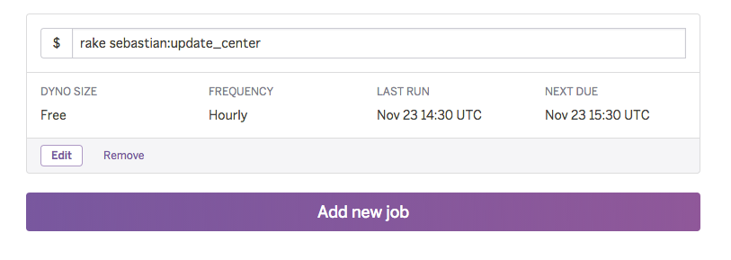

# Sebastian-badge.info
Hosting embed Jenkins plugin badges

http://sebastian-badge.info/

[](https://circleci.com/gh/sue445/sebastian-badge/tree/master)
[](https://gemnasium.com/sue445/sebastian-badge)
[](https://coveralls.io/r/sue445/sebastian-badge)
[](https://codeclimate.com/github/sue445/sebastian-badge)

[](http://waffle.io/sue445/sebastian-badge)

## Setup
```bash
cp config/.env{.example,}
vi config/.env

bundle exec rake ar:create
bundle exec rake ar:migrate

bundle exec padrino start
# or
bundle exec foreman start
```

## Testing
```bash
RACK_ENV=test bundle exec rake ar:create
RACK_ENV=test bundle exec rake ar:migrate
RACK_ENV=test bundle exec rake groonga:setup
bundle exec rspec
```

## Heroku
### Setup
```bash
heroku addons:add heroku-postgresql:hobby-dev
heroku addons:add papertrail
heroku addons:add rollbar
heroku addons:add newrelic:wayne
heroku addons:add memcachier:dev
heroku addons:add scheduler
heroku addons:add pgbackups:auto-month
heroku config:add ROLLBAR_ACCESS_TOKEN=XXXXXXXXXXXXXXXX
heroku config:add NEW_RELIC_LICENSE_KEY=XXXXXXXXXXXXXXXX
heroku config:set BUILDPACK_URL=https://github.com/groonga/heroku-buildpack-rroonga
```

### Scheduler
register `bundle exec rake sebastian:update_center` to heroku scheduler



### Deploy your Heroku account
[](https://heroku.com/deploy)
